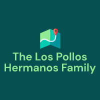

<h1 align="center">
   
The-los-pollos-hermanos-family 
</h1>


<div id="top"></div>


<!-- PROJECT LOGO -->
<br />
<div align="center">
<a>
    
   </a>
  
  <br>
  <br>


<!-- ABOUT THE PROJECT -->
## About The Project


Hello, we are The-los-pollos-hermanos-family. We are a team of four people. Our goal is to make a game about geography and history.

<br>
  
## Our Team
   
   
   
| Names                          | Role                |
| -------------                  | -------------       |
| DSGramatikov20@codingburgas.bg | Back-end developer  |
| KGTenev20@codingburgas.bg      | Scrum trainer       |
| DNKolev20@codingburgas.bg      | Back-end developer  |
| SDKehayov20@codingburgas.bg    | QA                  |


<br>
<br>
  
<!-- USAGE EXAMPLES -->
## Documentation and Presentation

[Documentation]() and 
[Presentation]()

  <br>
  <br>
  
<!-- LICENSE -->
## Our License
```c++
Look our license file named `LICENSE.txt` for more information.
```
<br>
<br>
  
  
## Discord Link
Project Link: [github.com/codingburgas/2223-educational-traveling-the-los-pollos-hermanos-family)

<p align="right">(<a href="#top">back to top</a>)</p>
